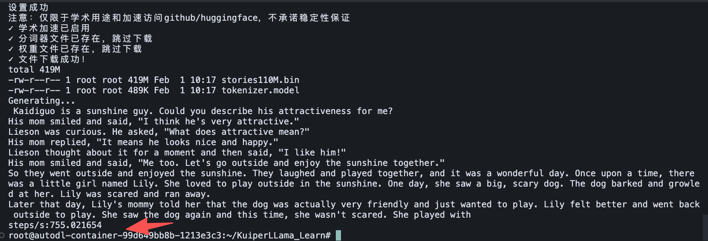

学习项目：https://github.com/zjhellofss/KuiperLLama

## 快速开始

本项目提供了三个便捷脚本来简化环境配置、编译和测试流程。

### 1. setup_env.sh - 环境依赖安装脚本

自动安装项目所需的所有依赖库，包括：
- **Armadillo** - C++ 线性代数库
- **GoogleTest** - C++ 单元测试框架
- **glog** - Google 日志库
- **sentencepiece** - 文本分词库
- **abseil-cpp** - Abseil C++ 通用库
- **re2** - Google 正则表达式库
- **nlohmann/json** - 现代 C++ JSON 库（header-only）

#### 特性：
- ✅ **智能权限管理**：自动检测是否为 root 用户，root 用户无需 sudo，普通用户自动添加 sudo
- ✅ **Git 加速优化**：配置 Git 参数以加速克隆，解决 autodl 环境下载慢的问题
- ✅ **镜像站点支持**：优先使用 Gitee 镜像，失败时自动回退到 GitHub
- ✅ **浅克隆优化**：使用 `--depth 1` 只克隆最新版本，大幅减少下载量

#### 使用方法：
```bash
bash setup_env.sh
```

#### 安装的依赖：
- Armadillo: `~/armadillo`
- GoogleTest: `~/googletest`
- glog: `~/glog`
- sentencepiece: `~/sentencepiece`

---

### 2. compile.sh - 项目编译脚本

编译整个项目，生成可执行文件和动态库。

#### 使用方法：
```bash
bash compile.sh
```

#### 编译说明：
- 使用 32 个并行任务进行编译（可根据 CPU 核心数调整）
- 编译输出：
  - 动态库：`lib/libllama.so`
  - Demo 可执行文件：`build/demo/llama_infer`
  - 测试可执行文件：`build/test/test_llm`

#### 自定义编译参数：
如果需要修改并行数，可以编辑 `compile.sh` 中的 `make -32` 为 `make -j$(nproc)` 或指定具体数字。

---

### 3. test_llama2_demo.sh - 模型下载和测试脚本

自动下载模型文件并运行 demo 测试。

#### 功能：
- ✅ **自动下载模型文件**：
  - 分词器：`tokenizer.model` (来自 yahma/llama-7b-hf)
  - 模型权重：`stories110M.bin` (来自 karpathy/tinyllamas)
- ✅ **多源下载支持**：
  - AutoDL 学术加速（自动启用）
  - hf-mirror.com 镜像站点
  - 原始 Hugging Face 链接
  - ghproxy.com 代理
- ✅ **智能文件检查**：如果文件已存在则跳过下载
- ✅ **自动运行 Demo**：下载完成后自动运行测试

#### 使用方法：
```bash
bash test_llama2_demo.sh
```

#### 下载的文件：
- `models/tokenizer.model` - 分词器模型
- `models/stories110M.bin` - TinyLlama 110M 模型权重

#### 网络问题解决：
如果下载失败，脚本会自动尝试多个下载源。也可以手动启用 AutoDL 学术加速：
```bash
source /etc/network_turbo
bash test_llama2_demo.sh
```

---

## 完整使用流程

1. **安装依赖**：
   ```bash
   bash setup_env.sh
   ```

2. **编译项目**：
   ```bash
   bash compile.sh
   ```

3. **下载模型并测试**：
   ```bash
   bash test_llama2_demo.sh
   ```

---

## 运行结果

运行测试后的结果展示：


